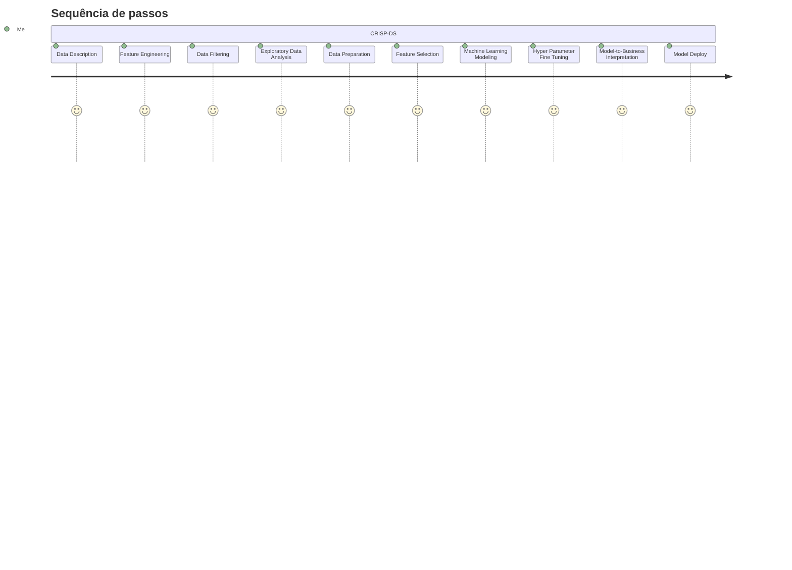

# Rossmann Drugstore Sales Prediction

Este repositório contém códigos para a predição de vendas da rede de farmácias Rossmann, localizada na Europa, possuindo mais de 4000 lojas em sete diferentes países.

Os dados utilizados neste projeto são reais e foram disponibilizados pela Rossmann no [Kaggle](https://www.kaggle.com/c/rossmann-store-sales). Apesar de o problema de negócio ser fictício, ele corresponde a um problema real: prever as vendas futuras das lojas para o planejamento das finanças da empresa.

## 1. O problema de negócio

O CFO da empresa convocou uma reunião com o time de dados e informou que as lojas precisavam passar por reformas. Portanto, ele gostaria de saber qual seria o faturamento das lojas nas próximas 6 semanas para que as reformas fossem programadas de acordo com o faturamento da empresa.

Foi pedido à cientista de dados, então, que desenvolvesse um modelo de previsão de vendas que determinasse o faturamento de cada loja nas próximas 6 semanas.

## 2. Resultado do modelo

O modelo previu que nas próximas 6 semanas o faturamento de todas as lojas seria de $286.435.616,00, com um erro médio absoluto (MAE) de 765 para cada loja - no melhor cenário, a empresa fatura $287.291.675,81 e no pior cenário, R$285.579.535,63.

## 3. Premissas do negócio

- O dataset possui 1115 lojas e as vendas estão dentro do período de 01/01/2013 a 31/07/2015.
- Os dias nos quais as lojas estão fechadas foram retirados da análise.
- Para as lojas com valor nulo na coluna de competidor próximo (competition_distance), foi considerado que não havia competidores por perto. Para futura utilização desse dado na fase de "feature engineering", o valor nulo foi trocado por 200.000 m (duas vezes o maior valor disponível). 

As variáveis do dataset original são as seguintes:

| Variável |	Definição |
| --- | --- |
| store |	id único de cada loja
| day_of_week |	indica o dia da semana que era aquele dia (começando com 1 = domingo)
| date |	data da venda
| sales |	faturamento da loja naquele dia
| customers |	número de clientes na loja naquele dia
| open |	loja aberta ou fechada (0 = closed, 1 = open)
| state_holiday |	feriado nacional (a = public holiday, b = Easter holiday, c = Christmas, 0 = Dia Comum)
| school_holiday |	indica se a loja naquele dia foi afetada pelo fechamento das escolas públicas
| store_type |	modelo da loja (a, b, c ou d)
| assortment |	nível de sortimento da loja (a = basic, b = extra, c = extended)
| competition_distance |	distancia, em metros, do competidor mais próximo
| competition_open_since_month |	mês da abertura do competidor mais próximo
| competition_open_since_year |	ano da abertura do competidor mais próximo
| promo |	se a loja está ou não com uma promoção ativa naquele dia
| promo2 |	indica se é uma promoção contínua e consecutiva (0 = store not participating, 1 = store participating)
| promo2_since_week |	semana do calendário na qual a loja entrou em Promo2
| promo2_since_year |	ano no qual a loja entrou em Promo2
| promo_interval |	meses do ano nos quais Promo2 é iniciada (ex: "Feb,May,Aug,Nov")

As variáveis criadas na fase de "feature engineering" foram as seguintes:

| Variável | Definição |
| --- | --- |
| year | ano no qual a venda foi realizada |
| month | mês no qual a venda foi realizada |
| day | dia no qual a venda foi realizada |
| week_of_year | semana do ano na qual a venda foi realizada (int type) |
| year_week | semana do ano na qual a venda foi realizada (obj type, %Y-%W) |
| competition_since | data de abertura das lojas competidoras próximas (junção de competition_open_since_month e competition_open_since_year) |
| competition_time_month | número de meses desde a abertura da loja competidora |
| promo_since | data de início da promoção (junção de promo2_since_week e promo2_since_year) |
| promo_time_week | número de semanas nas quais a promo2 estava ativa |

## 4. Estratégia de solução

O projeto foi desenvolvido seguindo o método CRISP-DS (Cross-Industry Standard Process - Data Science).

## 5. Os 3 principais insights extraídos dos dados

**1. Lojas com competidores mais próximos vendem menos**

**Falso** - Lojas com competidores mais próximos vendem mais.

**2. Lojas vendem mais no segundo semestre do ano**

**Falso** - Lojas vendem menos no segundo semestre do ano.

**3. Lojas vendem mais depois do dia 10 de cada mês**

**Verdadeiro** - Lojas vendem mais depois do dia 10 de cada mês 

## 6. Modelo de Machine Learning

Foram testados os seguintes modelos de ML: 

- Regressão linear
- Regressão linear regularizada (Lasso)
- Random Forest regressor
- XGBoost regressor

Esses foram os resultados após o Cross-Validation (MAE = mean absolute error; MAPE = mean absolut percentage error; RSME = root mean squared error):

O modelo selecionado foi o XGBoost e os resultados após o hypertuning são os seguintes:

Performance total:

## 7. Bot do Telegram

As predições de vendas de cada loja para as próximas 6 semanas são entregues via bot do [Telegram](http://t.me/rossmann_raianna_bot) (Clique em Telegram para acessar o bot).

## 8. Conclusão

O objetivo do presente projeto foi desenvolver um modelo de predição de vendas para as lojas Rossmann, e o projeto foi entregue ao CFO da empresa na forma de um bot do Telegram, onde podemos acessar o faturamento de cada empresa individualmente de forma rápida e eficaz.

## 9. Próximos passos

Seguindo o métido CRISP-DS, melhorias podem ser realizadas no modelo.

- Criar novas variáveis que podem melhorar a performance do modelo.
- Testar outros modelos de Machine Learning com melhor performance.
- Melhorar a reposta do bot do Telegram.

## 10. Referências

- Este projeto faz parte do módulo Data Science em Produção, da [Comunidade DS](https://comunidadeds.com/).
- Os dados foram coletados no [Kaggle](https://www.kaggle.com/c/rossmann-store-sales/data).

